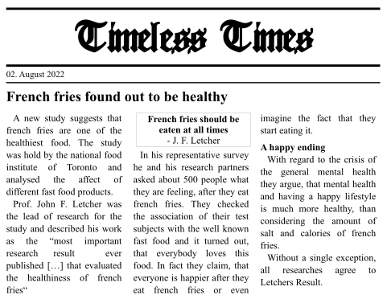

# Spring-Newspaper

This project contains a simple spring boot application that provides a REST API to retrieve digitized newspapers.

## Local development
Check out the branch `kotlin` or `java`, then you can run the application using `./gradlew bootRun`.
An example newspaper can be accessed using
```bash
curl -X POST http://localhost:8080/newspaper/1
```

## Domain model

A newspaper is a collection of articles with a name and a publication date. Each article contains a title, an optional author and a representation of the articles content.



The above newspaper contains only a single article and would be stored as the following json:
```json
{
  "id": 1,
  "name": "Timeless Times",
  "publicationDate": "2022-08-02T09:30:00Z",
  "articles": [
    {
        "title": "French fries found out to be healthy",
        "content": [
            {
                "@type": "Paragraph",
                "text": "A new study suggest that french fries..."
            },
            {
                "@type": "Paragraph",
                "text": "Prof. John F. Letcher was the lead of..."
            },
            {
                "@type": "Box",
                "children": [
                    {
                        "@type": "Paragraph",
                        "text": "French fries should be eaten..."
                    },
                    {
                        "@type": "Paragraph",
                        "text": "- J.F. Letcher"
                    }
                ]
            },
            {
                "@type": "Paragraph",
                "text": "In his representative survey he and his..."
            },
            {
                "@type": "Sectiom",
                "text": "A happy ending"
            },
            {
                "@type": "Paragraph",
                "text": "With regard to the crisis of the general..."
            },
            {
                "@type": "Paragraph",
                "text": "Without a single exception all researchers..."
            }
        ]
    }
  ]
}
```

It should be noted that boxes can be nested in any depth.